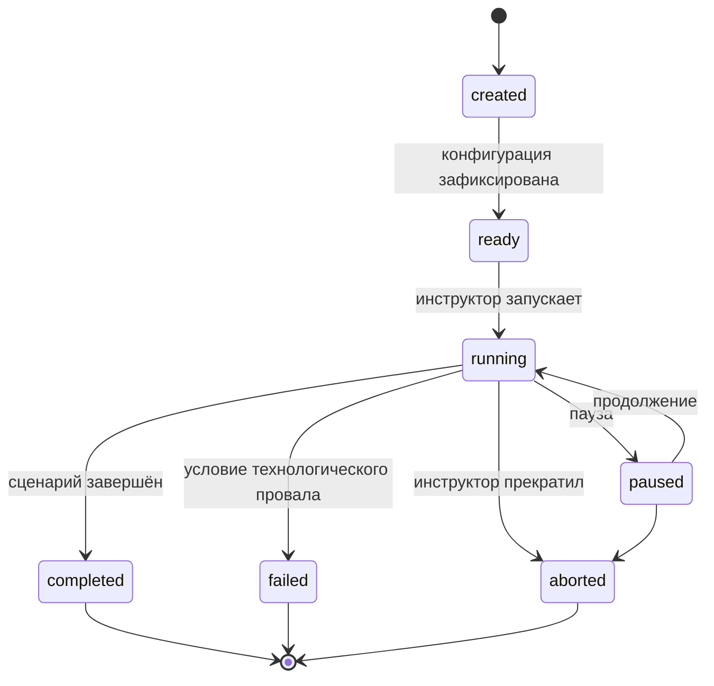
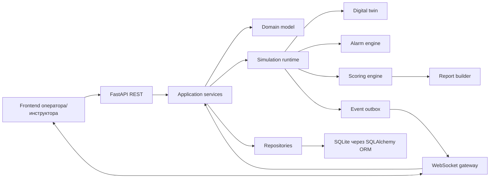

# Backend Project Specification: тренажёр операторов ЭЛОУ-АВТ

**Статус:** рабочая спецификация MVP  
**Версия:** 1.0  
**Дата:** 2026-08-10  
**Аудитория:** backend-разработчики, архитекторы, QA и coding agents  
**Источник истины для бэкенда:** этот документ. При расхождении с текущим `README.md` использовать эту спецификацию и зафиксированные ниже решения.

**Предметный сценарий:** [TRAINER_SCENARIO.md](TRAINER_SCENARIO.md). В нём подробно описаны технологическая цепочка, этапы и подэтапы прохождения, задачи оператора, развитие основного возмущения, правильные и неправильные действия, тревоги, критерии оценки и итоговый отчёт.

Если разработчику или агенту неясно, как должен вести себя тренажёр, либо он не уверен в трактовке этапа, действия оператора, оборудования или результата, он обязан сначала свериться с `TRAINER_SCENARIO.md`. Нельзя заполнять пробелы случайным предположением. Если сценарий также не даёт однозначного ответа или противоречит этой спецификации, необходимо зафиксировать вопрос и запросить решение у команды. При прямом противоречии текущая спецификация имеет приоритет, пока команда явно не изменит его.

## 1. Краткое описание проекта

Проект — компьютерный тренажёр для операторов установки ЭЛОУ-АВТ. Он моделирует один непрерывный производственный сеанс: подготовку установки, запуск трёх сырьевых потоков, предварительный теплообмен Т-1…Т-11, работу ЭЛОУ, Е-15, К-1, печей, К-2 и продуктовых линий, выход в устойчивый режим, скрытое технологическое возмущение, диагностику, восстановление и итоговый отчёт.

Тренажёр проверяет не запоминание последовательности экранов, а способность оператора:

- видеть взаимосвязи между участками установки;
- замечать слабый развивающийся тренд до критической тревоги;
- отличать первопричину от вторичных симптомов;
- выполнять безопасные действия в правильной последовательности;
- проверять эффект команды на ближайших и downstream-участках;
- сохранять качество работы при росте информационной и временной нагрузки.

Бэкенд является авторитетным источником состояния. Фронтенд отображает данные и отправляет намерения оператора, но не рассчитывает технологическую динамику, не классифицирует действия и не выставляет оценки.

## 2. Зафиксированные решения

| Область | Решение для текущего этапа |
|---|---|
| Основной язык | Python |
| Формат приложения | Модульный монолит с чёткими доменными границами |
| HTTP API | FastAPI, REST `/api/v1` |
| Обновления в реальном времени | WebSocket на сессию |
| Валидация контрактов | Pydantic |
| ORM и доступ к данным | SQLAlchemy ORM 2.x: declarative mapping, relationships, асинхронные сессии |
| Миграции | Alembic |
| Основная БД | SQLite, файловая БД через `sqlite+aiosqlite` |
| Физика процесса | Детерминированная упрощённая модель, конфигурируемые формулы и пороги |
| Основной сценарий | Сквозной ЭЛОУ-АВТ с постепенным снижением расхода одной из трёх ветвей |
| Уровни | Три уровня сложности одной сценарной логики |
| Длительность | 65 минут симуляционного времени, конфигурируется |
| Шаг расчёта | 1 секунда симуляционного времени |
| Шаг сохранения snapshot | 5 секунд, конфигурируется |
| Оценка | Детерминированные правила и конфигурируемые веса |
| ML | Вне текущего scope. Бэкенд только сохраняет совместимые события и snapshot-данные |
| Развёртывание MVP | Один экземпляр backend/simulation runtime; горизонтальное масштабирование позже |

Точные версии библиотек должны быть закреплены lock-файлом при создании проекта. Не следует привязывать доменную логику к конкретному веб-фреймворку или ORM.

### 2.1. Правила использования SQLAlchemy ORM и SQLite

- модели хранения описываются через SQLAlchemy ORM 2.x с `DeclarativeBase`, `Mapped` и `mapped_column`;
- ORM-модели находятся только в инфраструктурном слое и не заменяют доменные сущности;
- связи между таблицами выражаются внешними ключами и осмысленными `relationship`, но API не сериализует ORM-объекты напрямую;
- асинхронный URL по умолчанию: `sqlite+aiosqlite:///./var/npz_security_flow.db`; фактический путь задаётся через `DATABASE_URL`;
- рабочая БД является файловой. In-memory SQLite допустима только для узких unit-тестов, не для проверки миграций, блокировок и восстановления;
- файл БД, `-wal` и `-shm` не добавляются в Git;
- на каждом соединении включается `PRAGMA foreign_keys=ON`; для MVP также настраиваются `journal_mode=WAL` и ограниченный `busy_timeout`;
- транзакции должны быть короткими. Один tick одной сессии записывается одной транзакцией через unit of work;
- запись сериализуется внутри одного экземпляра приложения. Ошибка `database is locked` не скрывается: она ограниченно повторяется согласно явной retry-политике и регистрируется;
- миграции Alembic для операций, которые SQLite не поддерживает напрямую, используют batch mode;
- SQLite — сознательное ограничение конкурсного MVP. Несколько backend-инстансов и высокая конкурентная запись не проектируются до отдельного решения о смене хранилища.

## 3. Границы MVP

### 3.1. Входит в MVP

- каталог одной установки ЭЛОУ-АВТ и её оборудования;
- версионируемый шаблон сквозного сценария;
- три уровня сложности;
- создание, запуск, пауза, продолжение, завершение и аварийное прекращение сессии;
- детерминированный цифровой двойник с симуляционными часами;
- три параллельные сырьевые ветви;
- агрегированные модели Т-1…Т-11, ЭЛОУ, Е-15, Н-20, К-1, печей, К-2 и продуктовых потоков;
- скрытое постепенное возмущение одной ветви;
- обработка команд оператора и технологических блокировок;
- тревоги уровней L1…L5 и второстепенные тревоги;
- явная фиксация отклонения и диагноза оператором;
- проверка последовательности действий;
- проверка результата корректирующей команды;
- SAGAT-контрольные вопросы;
- анкета Raw NASA-TLX после уровня;
- детерминированная оценка прохождения;
- итоговый отчёт и сравнение трёх уровней;
- полный событийный журнал и воспроизводимый replay.

### 3.2. Не входит в текущий этап

- обучение, инференс и деплой ML-модели;
- автоматическое управление установкой ИИ;
- промышленная аттестация персонала;
- точная гидродинамическая или термодинамическая модель реального НПЗ;
- OPC/SCADA/DCS-интеграции;
- несколько разных установок;
- многопользовательское совместное управление одной сессией;
- распределённое выполнение симуляции;
- мобильное приложение;
- генерация рекомендаций с помощью LLM;
- хранение биометрии или медицинских показателей.

ML-слой в будущем должен подключаться через отдельный порт/адаптер. Его отсутствие не должно блокировать прохождение сценария, оценивание и формирование отчёта.

## 4. Пользователи и роли

Доступ построен по RBAC с минимальными правами. Роль — это упаковка прав, но решение
по каждому запросу принимается по конкретному праву: набор ролей у заказчика может
отличаться, а разделение полномочий должно сохраняться.

### Роли текущего этапа

| Роль | Права |
|---|---|
| Обучаемый/оператор (`trainee`) | прохождение назначенных сценариев, просмотр собственных результатов |
| Инструктор (`instructor`) | назначение сценариев, запуск и остановка обучения, наблюдение за сессией, чтение любого отчёта |
| Эксперт (`expert`) | просмотр отчётов и результатов, анализ ошибок, выгрузка данных, утверждение предложений |
| Администратор ИБ (`security_admin`) | просмотр аудита, расследование событий, управление политиками и учётными записями |

### Самостоятельное прохождение (`guest`)

Пульт открыт без входа: тренажёр должен быть доступен обучаемому, у которого нет ни
учётной записи, ни инструктора рядом. Такому субъекту сервер выдаёт гостевой токен и
роль `guest` — завести, вести и пройти **своё** прохождение, читать свой отчёт.
Чужие сессии, чужие отчёты, кабинет эксперта и журнал доступа ему закрыты.

Право вести ход у него отдельное — `session.control_own`, «только своё», — а не
ослабленный `session.control`. Иначе «ведёт чужое обучение» и «сам себе включил
тренажёр» перестали бы различаться и в матрице прав, и в журнале, а разделение
полномочий инструктора стало бы мнимым.

Роль не назначается учётной записи: её выдаёт себе сервер вместе с токеном, а
`POST /users` с `roles: ["guest"]` отклоняется как `ROLE_NOT_AVAILABLE`. Режим
отключается настройкой контура (`ALLOW_GUEST_TRAINING=false`) там, где обучение
должно быть именным.

### Роли следующего цикла

| Роль | Права |
|---|---|
| Автор сценариев (`scenario_author`) | создание и изменение сценариев в своей рабочей области |
| Администратор (`admin`) | управление конфигурацией и пользователями |
| Оператор сопровождения/ТП (`support`) | техническая поддержка без доступа к содержимому отчётов |

Они описаны в матрице и покрыты тестами, но не назначаются: запрос на выдачу такой
роли отклоняется кодом `ROLE_NOT_AVAILABLE`. Так модель остаётся полной и проверяемой,
а поверхность доступа — только реализованной.

### Права, требующие раздельного контроля

`session.control` (запуск сценария), `scenario.edit`, `safety_rules.edit`,
`scoring.edit`, `risk_model.edit`, `results.delete`, `data.export`, `account.manage`.

Из них следуют инварианты, проверяемые тестами:

- автор сценариев не получает прав менять системные правила безопасности, scoring,
  модель риска и удалять результаты обучения;
- инструктор ведёт прохождение, но не подаёт команды на установку вместо оператора:
  иначе журнал перестаёт отвечать на вопрос, чей навык проверяется;
- завести прохождение чужим именем может только тот, кто ведёт чужое обучение: иначе
  результаты оказались бы подписаны произвольным идентификатором;
- гостевая роль не назначается учётной записи, поэтому `session.control` остаётся
  у одного субъекта — инструктора;
- администратор ИБ расследует события, но содержимого отчётов об обучении не видит;
- техподдержка видит факт и состояние прохождения, но не его содержание;
- ни одна роль текущего этапа не собирает все критичные права разом.

### Аутентификация

Вход по логину и паролю выдаёт непрозрачный токен доступа. Самостоятельное
прохождение получает токен без проверки личности и пишется в журнал отдельным кодом
события (`guest_session`), чтобы администратор ИБ отличал его от проверенного входа. Ролей и срока в токене нет:
состояние сеанса хранится на сервере, поэтому отзыв роли и отключение учётной записи
действуют немедленно, а не по истечении срока. Пароль хранится как `scrypt` с
индивидуальной солью, токен — как SHA-256 от значения.

Логин учётной записи совпадает с `operator_id` в журнале прохождений: правило «свои
результаты» проверяется сравнением идентификаторов, отдельный справочник соответствий
не нужен.

Проверки доступа находятся в доменном и API-слое. Фронтенд прячет недоступные разделы,
но это удобство интерфейса: прямое обращение отклоняется тем же правилом.

### Аудит доступа

Вход, выход, отказ в доступе, заведение и отключение учётной записи, выдача и отзыв
роли, смена пароля фиксируются в `security_events`. Запись неизменяема; отказ хранится
вместе с запрошенным правом и адресом ручки. Адрес клиента не сохраняется — сбор
персональных данных ограничен минимально необходимыми идентификаторами участника.

## 5. Термины

| Термин | Значение |
|---|---|
| Сценарий | Версионированное описание этапов, возмущений, правил, тревог и оценки |
| Сессия | Одно прохождение конкретной версии сценария конкретным оператором |
| Уровень | Конфигурация сложности: скорость развития, шум тревог, задержка датчика, подсказки и дедлайн |
| Snapshot | Снимок технологического и поведенческого состояния в момент симуляционного времени |
| Domain event | Неизменяемый факт: команда, тревога, переход этапа, блокировка, восстановление |
| Симуляционное время | Время внутри тренажёра; останавливается при паузе |
| Реальное время | UTC-время сервера; используется для аудита и эксплуатации |
| Первичная тревога | Первый доступный оператору признак снижения расхода ветви |
| Корректное действие | Команда, соответствующая установленной первопричине и правилам сценария |
| Проверка результата | Набор явных наблюдений после команды, подтверждающий восстановление и отсутствие downstream-последствий |
| Устойчивый режим | Все обязательные параметры находятся в допустимой области непрерывно заданное время |

## 6. Технологическая карта

```text
резервуарный парк
→ Н-1 / Н-1А / Н-1Б / Н-1В
→ три сырьевые ветви FRC-404 / FRC-405 / FRC-406
→ Т-1…Т-11
→ А-19 и подача воды
→ Э-1 / Э-3 / Э-5
→ А-20
→ Э-2 / Э-4 / Э-6
→ Е-15
→ Н-20 / Н-20А / Н-20Б
→ Т-17…Т-27
→ К-1
→ П-1 / П-2 / П-3
→ К-2
→ ЦО-1 / ЦО-2 / ЦО-3
→ К-3/1 / К-3/2 / К-3/3
→ К-4
→ опционально К-9 / К-10
→ продуктовые линии
```

Модель должна сохранять причинные задержки: команда не меняет всю установку мгновенно. Возмущение сначала проявляется в одной сырьевой ветви, затем влияет на Т-1…Т-11, ЭЛОУ, Е-15, К-1, печи, К-2 и продукты.

## 7. Этапы сценария

| Код | Назначение | Пример условия завершения |
|---|---|---|
| `precheck` | Осмотр готовности установки | Обязательные проверки выполнены, критических блокировок нет |
| `feed_preparation` | Выбор оборудования и подготовка линий | Насос и линии готовы |
| `feed_startup` | Появление трёх потоков | Все три расхода выше минимального пускового значения |
| `t1_t3` | Начальный предварительный подогрев | Потоки проходят первый участок |
| `t4_t7` | Контроль трёх ветвей | Рассогласование в допустимой области |
| `t7_t11` | Завершение предварительного подогрева | Температура и давление устойчивы, температура не выше ограничения |
| `elou_feed_and_water` | Подача промывочной воды | Соотношение воды и нефти допустимо |
| `elou_stage_1` | Первая ступень ЭЛОУ | Уровни, напряжение и разделение устойчивы |
| `elou_stage_2` | Вторая ступень ЭЛОУ | Условия второй ступени соблюдены |
| `e15` | Стабилизация потока после ЭЛОУ | Уровень Е-15 и Н-20 устойчивы |
| `post_elou_heating` | Т-17…Т-27 | Сырьё подготовлено к К-1 |
| `k1` | Работа первой колонны | Давление, уровни и температуры в диапазоне |
| `furnaces` | Контроль расход/тепловая нагрузка | Соотношение безопасно |
| `k2` | Атмосферная колонна и орошения | К-2 устойчиво работает |
| `side_draws_and_products` | Боковые отборы и продукты | Потоки стабильны |
| `stable_mode` | Подтверждение нормального режима | Все обязательные параметры допустимы непрерывно N секунд |
| `disturbance_monitoring` | Скрытое возмущение | Оператор обнаружил отклонение или ситуация эскалировала |
| `diagnosis_and_correction` | Диагностика и воздействие | Выполнено корректное действие либо достигнуто условие провала |
| `recovery` | Распространение эффекта исправления | Первичные параметры восстановлены |
| `final_stabilization` | Downstream-проверки | Вся цепочка устойчива и обязательные проверки завершены |

Время является ориентиром, а не единственным условием перехода. У каждого этапа должны быть `entry_condition`, `success_condition`, `failure_condition`, `timeout_s` и список обязательных проверок.

## 8. Машины состояний

### 8.1. Жизненный цикл сессии



Разрешённые переходы должны проверяться в доменном слое. Повторный одинаковый запрос не должен создавать второй переход.

### 8.2. Состояние тревоги

```text
inactive → active_unacknowledged → active_acknowledged → cleared
```

Повторное подтверждение идемпотентно. Очищенная тревога не удаляется, а остаётся в журнале.

### 8.3. Состояние команды

```text
received → validated → accepted → applied → effect_pending → evaluated
                    ↘ rejected
              ↘ cancelled
```

Классификация `correct/ineffective/dangerous` может быть окончательной только после окна наблюдения эффекта. Синтаксически допустимая команда не обязательно является правильной.

## 9. Уровни сложности

Одна сценарная логика выполняется на трёх уровнях. Все значения должны находиться в конфигурации версии сценария.

| Параметр | Уровень 1 | Уровень 2 | Уровень 3 |
|---|---|---|---|
| Скорость развития | Низкая | Средняя | Высокая |
| Второстепенные тревоги | Минимум | Средне | Много |
| Задержка датчика | Нет | Небольшая | Выраженная |
| Подсказки | Доступны | Ограничены | Нет |
| Дедлайн реакции | Большой | Средний | Малый |
| Запуск/доступность резерва | Простой | С задержкой | Ограниченный/с задержкой |

Конкретные числа являются методическими настройками и не должны быть зашиты в код.

## 10. Возмущение и правильный путь

После подтверждения устойчивого режима бэкенд выбирает скрытые параметры из опубликованной конфигурации и seed сессии:

- целевую ветвь `1..3`;
- момент начала;
- скорость развития;
- скрытую первопричину;
- интенсивность второстепенных тревог;
- задержки датчиков.

Скрытые значения сохраняются для аудита, но не возвращаются в операторский API или WebSocket.

### 10.1. Эталонная последовательность

1. Оператор явно фиксирует отклонение.
2. Сравнивает три расхода.
3. Определяет проблемную ветвь.
4. Проверяет расход до и после участка.
5. Проверяет давление.
6. Проверяет состояние насосов.
7. Проверяет командное и фактическое положение регулятора.
8. Отправляет диагноз.
9. Выполняет действие, соответствующее первопричине.
10. Подтверждает восстановление расхода.
11. Проверяет Т-1…Т-11.
12. Проверяет ЭЛОУ.
13. Проверяет Е-15 и Н-20.
14. Проверяет К-1.
15. Проверяет печи.
16. Проверяет К-2 и продукты.

Проверка должна быть явным доменным событием. Сам факт открытия экрана не доказывает понимание состояния.

### 10.2. Классификация действий

| Класс | Правило |
|---|---|
| `correct` | Соответствует причине, предусловиям и улучшает процесс |
| `unnecessary` | Не требовалось и не улучшило состояние |
| `ineffective` | Воздействует на симптом, но не устраняет причину |
| `dangerous` | Увеличивает технологический риск или нарушает защиту |
| `out_of_sequence` | Выполнено до обязательной диагностики/проверки |
| `repeated` | Дублирует уже принятую команду без новой необходимости |
| `cancelled` | Отменено до применения |
| `rejected` | Не выполнено из-за блокировки или нарушенных предусловий |
| `unverified` | Эффект команды не подтверждён обязательными проверками |

### 10.3. Пример опасной компенсации

При падении расхода оператор увеличивает нагрузку печи, не устранив причину. Команда может быть технически применена, но должна породить событие `dangerous_heat_compensation`, увеличить штраф безопасности и изменить дальнейшую динамику.

## 11. Тревоги

Основная цепочка эскалации:

| Уровень | Событие |
|---|---|
| L1 | Отклонение расхода одной ветви |
| L2 | Рассогласование трёх потоков |
| L3 | Изменение/выход температуры после Т-1…Т-11 |
| L4 | Отклонение нагрузки или условий ЭЛОУ |
| L5 | Отклонение подачи на К-1 и дальнейшее распространение |

Правило тревоги включает:

- источник и контролируемый параметр;
- порог включения;
- гистерезис/порог отключения;
- минимальную длительность нарушения;
- уровень;
- текст;
- признак обязательного подтверждения;
- downstream-зависимости;
- версию правила.

При устранении первопричины вторичные тревоги должны исчезать через физическую динамику и правила, а не удаляться вручную.

## 12. Симуляционный цикл

Каждый tick выполняется одним последовательным владельцем сессии:

```text
1. Получить неприменённые команды с sequence_no
2. Проверить предусловия, блокировки и идемпотентность
3. Применить принятые команды
4. Активировать/обновить скрытое возмущение
5. Рассчитать новое технологическое состояние
6. Вычислить производные параметры
7. Проверить тревоги, блокировки и критические события
8. Проверить переход этапа и устойчивый режим
9. Оценить ожидаемые эффекты предыдущих команд
10. Создать domain events
11. Сохранить события и при необходимости snapshot в одной транзакции
12. Опубликовать безопасное состояние через WebSocket
```

Требования:

- симуляционное время изменяется только runtime-компонентом;
- пауза останавливает симуляционное время;
- обработка одной сессии строго последовательна;
- повторный запрос с тем же `request_id` возвращает прежний результат;
- вычисления воспроизводятся из версии конфигурации, seed и журнала команд;
- при перезапуске сервис восстанавливает сессию из последнего snapshot и последующих событий.

## 13. Предлагаемая архитектура



### 13.1. Модули

- `catalog` — установка, оборудование, теги и топология;
- `scenario` — версии сценария, этапы, правила и возмущения;
- `sessions` — жизненный цикл прохождения;
- `simulation` — часы, tick и цифровой двойник;
- `commands` — команды, блокировки, идемпотентность и эффект;
- `alarms` — жизненный цикл тревог;
- `observations` — фиксация отклонения, диагноз и проверки;
- `assessment` — SAGAT, NASA-TLX и детерминированные оценки;
- `reports` — итоговый и сравнительный отчёты;
- `realtime` — WebSocket-проекции;
- `persistence` — SQLAlchemy ORM-модели, mapper-ы, репозитории, unit of work и Alembic-миграции для SQLite;
- `audit` — неизменяемый журнал событий;
- `ml_port` — только интерфейс будущего адаптера, без реализации ML.

### 13.2. Рекомендуемая структура каталога

```text
backend/
├── pyproject.toml
├── uv.lock
├── alembic.ini
├── Dockerfile
├── app/
│   ├── main.py
│   ├── api/v1/
│   ├── core/
│   ├── domain/
│   │   ├── catalog/
│   │   ├── scenario/
│   │   ├── sessions/
│   │   ├── simulation/
│   │   ├── alarms/
│   │   └── assessment/
│   ├── application/
│   ├── infrastructure/
│   │   ├── db/
│   │   ├── repositories/
│   │   └── realtime/
│   └── settings.py
├── migrations/
└── tests/
    ├── unit/
    ├── integration/
    ├── contract/
    └── e2e/
```

Domain-модули не импортируют FastAPI, SQLAlchemy или конкретный WebSocket-код.

## 14. Модель данных

### 14.1. Общие правила

- идентификаторы — UUID на уровне домена и API, в SQLite сохраняются канонической строкой;
- реальное время — timezone-aware `datetime` в UTC; ORM нормализует значение перед записью в SQLite;
- симуляционное время — целое число миллисекунд в `BigInteger`;
- денежные данные отсутствуют;
- технологические значения MVP хранятся через SQLAlchemy `Float`;
- JSON-конфигурации хранятся через SQLAlchemy `JSON`, поддерживаемый SQLite как сериализованный JSON-текст;
- перечисления сохраняются стабильными строковыми значениями, а не зависят от номера элемента enum;
- внешние ключи реально проверяются благодаря `PRAGMA foreign_keys=ON` на каждом соединении;
- конфигурации публикуются неизменяемыми версиями;
- для упорядочивания событий используется монотонный `sequence_no` внутри сессии;
- важные бизнес-ограничения дублируются constraint/index в БД;
- удаление завершённых сессий по умолчанию запрещено.

### 14.2. Каталог установки

#### `installation_versions`

- `id`;
- `installation_code`;
- `version`;
- `name`;
- `status: draft/published/archived`;
- `config_json`;
- `created_at`, `published_at`.

#### `equipment`

- `id`, `installation_version_id`;
- `code` (`T-4/1`, `E-3`, `K-1`);
- `equipment_type`;
- `parent_equipment_id`;
- `display_name`;
- `metadata_json`.

Уникальный индекс: `(installation_version_id, code)`.

#### `process_tags`

- `id`, `equipment_id`;
- `code`;
- `value_type`;
- `unit`;
- `normal_min/max`;
- `warning_min/max`;
- `critical_min/max`;
- `visible_to_operator`;
- `metadata_json`.

#### `topology_edges`

- `from_equipment_id`, `to_equipment_id`;
- `stream_code`;
- `branch_no`;
- `stream_type`;
- `metadata_json`.

### 14.3. Конфигурация сценария

#### `scenario_versions`

- `id`, `scenario_code`, `version`;
- `installation_version_id`;
- `name`, `description`;
- `duration_ms`;
- `status`;
- `config_json`;
- `created_at`, `published_at`.

#### `scenario_levels`

- `id`, `scenario_version_id`, `level_no`;
- `sensor_delay_ms`;
- `nuisance_alarm_rate`;
- `reaction_deadline_ms`;
- `development_speed_factor`;
- `hints_enabled`;
- `reserve_config_json`.

#### `scenario_stages`

- `id`, `scenario_version_id`;
- `code`, `order_no`;
- `entry_rule_json`;
- `success_rule_json`;
- `failure_rule_json`;
- `timeout_ms`;
- `required_checks_json`.

#### `disturbance_templates`

- `id`, `scenario_version_id`;
- `code`;
- `cause_code`;
- `eligible_targets_json`;
- `onset_rule_json`;
- `development_rule_json`;
- `recovery_rule_json`;
- `hidden_config_json`.

#### `expected_action_rules`

- `id`, `scenario_version_id`;
- `situation_code`;
- `action_type`, `target_selector`;
- `required_preconditions_json`;
- `valid_window_ms`;
- `expected_effect_json`;
- `verification_rule_json`;
- `criticality`, `weight`.

#### `alarm_rules`

- `id`, `scenario_version_id`;
- `code`, `level`;
- `source_expression_json`;
- `activation_delay_ms`;
- `clear_expression_json`;
- `ack_required`;
- `message_template`.

#### `scoring_policy_versions`

- `id`, `code`, `version`, `status`;
- `weights_json`;
- `penalties_json`;
- `stability_rule_json`;
- `reaction_rule_json`.

### 14.4. Прохождение

#### `training_sessions`

- `id`;
- `operator_id`, `instructor_id`;
- `scenario_version_id`, `scenario_level_id`;
- `scoring_policy_version_id`;
- `status`;
- `sim_time_ms`;
- `current_stage_code`;
- `random_seed`;
- `hidden_runtime_config_json`;
- `started_at`, `paused_at`, `completed_at`;
- `version_no` для optimistic locking;
- `final_outcome`.

`hidden_runtime_config_json` никогда не сериализуется в операторский DTO.

#### `session_stage_history`

- `session_id`, `stage_code`;
- `entered_sim_time_ms`, `exited_sim_time_ms`;
- `outcome`;
- `transition_reason_event_id`.

#### `process_snapshots`

- `id`, `session_id`;
- `sequence_no`, `sim_time_ms`;
- `stage_code`;
- `visible_values_json`;
- `derived_values_json`;
- `internal_state_json`;
- `schema_version`;
- `state_hash`;
- `created_at`.

Уникальные индексы:

- `(session_id, sequence_no)`;
- `(session_id, sim_time_ms)`.

`internal_state_json` доступен только replay/аудиту и не возвращается оператору.

#### `session_events`

- `id`, `session_id`, `sequence_no`;
- `sim_time_ms`, `occurred_at`;
- `event_type`;
- `aggregate_type`, `aggregate_id`;
- `payload_json`;
- `causation_id`, `correlation_id`;
- `schema_version`.

События неизменяемы. Исправление выполняется компенсирующим событием.

### 14.5. Действия и наблюдения

#### `operator_actions`

- `id`, `request_id UNIQUE`, `session_id`;
- `sequence_no`, `sim_time_ms`, `received_at`;
- `action_type`, `target_code`;
- `requested_value_json`;
- `before_state_json`, `after_state_json`;
- `status`;
- `rejection_reason`;
- `classification`;
- `evaluation_pending_until_ms`;
- `expected_rule_id`;
- `requires_verification`.

#### `operator_observations`

- `id`, `request_id`, `session_id`;
- `sim_time_ms`;
- `observation_type`;
- `target_code`;
- `payload_json`.

Допустимые типы включают `declare_deviation`, `compare_flows`, `inspect_pressure`, `inspect_equipment`, `verify_result`.

#### `operator_diagnoses`

- `id`, `session_id`, `sim_time_ms`;
- `affected_area_code`;
- `deviation_code`;
- `suspected_cause_code`;
- `confidence_optional`;
- `is_correct` — внутреннее поле отчёта, не возвращается во время прохождения.

### 14.6. Тревоги

#### `session_alarms`

- `id`, `session_id`, `alarm_rule_id`;
- `alarm_code`, `level`, `equipment_code`;
- `started_sim_time_ms`;
- `acknowledged_sim_time_ms`;
- `cleared_sim_time_ms`;
- `acknowledged_by_operator_id`;
- `is_nuisance`;
- `source_event_id`.

### 14.7. Оценивание

#### `sagat_checkpoints`

- `id`, `session_id`, `checkpoint_code`;
- `triggered_sim_time_ms`;
- `status`;
- `answers_deadline_real_time`.

#### `sagat_answers`

- `checkpoint_id`, `question_code`;
- `answer_json`;
- `score: 0/0.5/1`;
- `submitted_at`.

#### `nasa_tlx_responses`

- `session_id` или связанная группа уровней;
- шесть ответов `0..10`;
- `raw_tlx_score`;
- `submitted_at`.

NASA-TLX не уменьшает квалификационную оценку.

#### `score_events`

- `id`, `session_id`, `sim_time_ms`;
- `dimension`;
- `delta`;
- `rule_code`;
- `reason`;
- `source_event_id`.

#### `session_scores`

- `session_id`;
- `safety_score`;
- `action_correctness_score`;
- `process_stability_score`;
- `reaction_score`;
- `resultiveness_score`;
- `situation_awareness_score`;
- `recovery_time_ms`;
- `raw_nasa_tlx`;
- `calculated_at`;
- `scoring_policy_version_id`.

#### `session_reports`

- `id`, `session_id`;
- `report_version`;
- `report_json`;
- `generated_at`.

PDF является производным артефактом и может быть восстановлен из `report_json`.

### 14.8. Индексы и хранение

Обязательные индексы:

- все внешние ключи;
- `session_events(session_id, sequence_no)`;
- `process_snapshots(session_id, sim_time_ms)`;
- `operator_actions(session_id, sim_time_ms)`;
- `session_alarms(session_id, started_sim_time_ms)`;
- `training_sessions(operator_id, started_at DESC)`;
- частичный индекс активных сессий по статусу.

Не создавать отдельную таблицу для каждого аппарата. Различия оборудования описываются каталогом, тегами и версионированными конфигурациями.

## 15. API

Все контракты версионируются под `/api/v1`. Время в API: `sim_time_ms` и ISO-8601 UTC для реального времени.

### 15.1. Каталог и сценарии

- `GET /api/v1/scenarios`;
- `GET /api/v1/scenarios/{scenario_version_id}`;
- `GET /api/v1/installations/{installation_version_id}/topology`.

Операторский DTO не содержит скрытых причин, seed, момента возмущения и истинной интенсивности.

### 15.2. Сессии

- `POST /api/v1/sessions`;
- `GET /api/v1/sessions/{session_id}`;
- `POST /api/v1/sessions/{session_id}/start`;
- `POST /api/v1/sessions/{session_id}/pause`;
- `POST /api/v1/sessions/{session_id}/resume`;
- `POST /api/v1/sessions/{session_id}/abort`;
- `GET /api/v1/sessions/{session_id}/state`.

Мутирующие запросы принимают `request_id` и, где уместно, `expected_version`.

### 15.3. Управление

- `POST /api/v1/sessions/{session_id}/actions`;
- `POST /api/v1/sessions/{session_id}/observations`;
- `POST /api/v1/sessions/{session_id}/diagnoses`;
- `POST /api/v1/sessions/{session_id}/alarms/{alarm_id}/acknowledge`.

Пример команды:

```json
{
  "request_id": "uuid",
  "action_type": "set_control_valve",
  "target_code": "FRC-405",
  "value": {"opening_pct": 82.0},
  "client_sim_time_ms": 3275000
}
```

Ответ подтверждает только принятие/отклонение. Окончательная оценка эффекта может появиться позже.

### 15.4. SAGAT и NASA-TLX

- `GET /api/v1/sessions/{session_id}/sagat/current`;
- `POST /api/v1/sessions/{session_id}/sagat/{checkpoint_id}/answers`;
- `POST /api/v1/sessions/{session_id}/nasa-tlx`.

### 15.5. Отчёты

- `GET /api/v1/sessions/{session_id}/report`;
- `GET /api/v1/operators/{operator_id}/level-comparison`.

### 15.6. WebSocket

- `WS /ws/v1/sessions/{session_id}`.

События клиенту:

- `session_state`;
- `process_snapshot`;
- `alarm_raised`;
- `alarm_updated`;
- `stage_changed`;
- `action_status_changed`;
- `sagat_requested`;
- `session_completed`.

Каждое сообщение содержит `schema_version`, `session_id`, `sequence_no` и `sim_time_ms`. Клиент использует `sequence_no` для обнаружения пропусков и при необходимости запрашивает актуальное состояние REST-методом.

### 15.7. Ошибки

Единый формат:

```json
{
  "error": {
    "code": "ACTION_PRECONDITION_FAILED",
    "message": "Команда не может быть применена в текущем состоянии",
    "details": {},
    "request_id": "uuid"
  }
}
```

Не возвращать stack trace, SQL и скрытую конфигурацию.

## 16. Оценка оператора

### 16.1. Результативность

Начальная формула MVP хранится в scoring policy:

```text
resultiveness =
0.40 × safety
+ 0.25 × action_correctness
+ 0.20 × process_stability
+ 0.15 × reaction_speed
```

Все составляющие находятся в диапазоне `0..100`. Веса не зашиваются в Python-код.

### 16.2. Безопасность

Начинается со 100. Снижается за критические действия, пропущенные тревоги, обход защит и время в критической области. Штрафы версионируются.

Опасные действия определяются правилами технолога, а не ML.

### 16.3. Правильность действий

```text
score = выполненный вес эталонных шагов / максимальный вес × 100
```

Критические шаги могут иметь больший вес. Повторные, отменённые и out-of-sequence-команды фиксируются отдельно.

### 16.4. Стабильность процесса

Рассчитывается как интегральный штраф по времени и нормированному отклонению параметров. Короткое небольшое отклонение влияет меньше, чем длительное критическое.

### 16.5. Скорость реакции

Отсчёт начинается с первого доступного оператору признака, а не со скрытого момента возмущения.

```text
reaction_score = 100 × min(1, target_time / actual_time)
```

Если корректное действие не начато, балл равен нулю.

### 16.6. Восстановление

Время считается от скрытого начала возмущения до момента, когда обязательные параметры вернулись в диапазон и оставались там непрерывно `stability_confirmation_ms`, для MVP ориентировочно 20 секунд. Значение конфигурируется.

### 16.7. SAGAT

Ответы типов «что изменилось», «что это означает», «что произойдёт дальше» оцениваются `0`, `0.5` или `1`.

```text
situation_awareness = earned / maximum × 100
```

### 16.8. NASA-TLX

Шесть шкал `0..10` приводятся к одному направлению и усредняются. Показатель хранится отдельно и не снижает результативность.

### 16.9. Сравнение уровней

```text
efficiency_retention = level_3_resultiveness / level_1_resultiveness × 100
absolute_drop = level_1_resultiveness - level_3_resultiveness
```

Сводный индекс допустим только как дополнительная визуализация. Исходные составляющие всегда остаются доступны.

## 17. Итоговый отчёт

`report_json` должен содержать:

- идентификаторы оператора, сессии, сценария, уровня и версий;
- итог `stabilized / not_stabilized / aborted`;
- время прохождения, обнаружения, реакции и восстановления;
- четыре составляющие результативности и общий балл;
- SAGAT и Raw NASA-TLX;
- временную шкалу параметров, тревог, команд и этапов;
- критические, опасные, лишние, повторные и отменённые действия;
- пропущенные и просроченные тревоги;
- нарушения последовательности;
- действия без обязательной проверки;
- downstream-проверки;
- параметры, которые дольше всего находились вне диапазона;
- правила и версии, использованные при расчёте.

Текстовые выводы строятся из детерминированных шаблонов, например:

- «быстро обнаруживает отклонение, но не проверяет downstream-последствия»;
- «правильно диагностирует причину, однако теряет время при потоке тревог»;
- «компенсирует температурный симптом без восстановления расхода».

## 18. Нефункциональные требования

### Надёжность и воспроизводимость

- одинаковые `scenario_version + level + seed + action log` дают одинаковый replay;
- каждый snapshot имеет `state_hash`;
- завершённый отчёт можно пересчитать из журнала и версии правил;
- runtime корректно отменяет фоновые задачи при остановке;
- восстановление после перезапуска не дублирует команды или события.

### Производительность MVP

- API-команда не ждёт полного будущего расчёта эффекта;
- WebSocket отправляет агрегированный снимок не чаще установленного интервала;
- записи snapshot выполняются пакетно/транзакционно;
- избегать запроса по одному тегу и N+1-запросов;
- нагрузочная цель должна быть измерена до финальной демонстрации; предварительно проектировать минимум на 20 одновременных сессий, но не заявлять это как подтверждённый SLA без теста.

### Безопасность

- секреты только через environment/secret storage;
- скрытая причина и внутреннее состояние отделены от операторских DTO;
- проверка ролей выполняется на сервере;
- входные значения органов управления ограничиваются allowlist и диапазонами;
- аудит мутирующих действий обязателен;
- SQL, stack trace и внутренние правила не попадают клиенту.

### Наблюдаемость

- структурированные JSON-логи;
- `request_id`, `session_id`, `correlation_id`;
- метрики tick-duration, command-latency, active-sessions, WebSocket-clients, DB-errors;
- health/readiness endpoints;
- отдельный лог расхождения replay/hash.

## 19. Тестирование

### Unit

- переходы машин состояний;
- формулы цифрового двойника;
- активация и очистка тревог;
- блокировки команд;
- классификация действий;
- подтверждение устойчивого режима;
- формулы оценки;
- NASA-TLX и SAGAT.

### Property/invariant tests

- уровень ЭЛОУ ниже 3500 мм отключает высоковольтную секцию;
- скрытые поля отсутствуют в операторском DTO;
- симуляционное время не движется на паузе;
- `sequence_no` строго возрастает;
- одинаковый seed и журнал дают одинаковый hash;
- итоговые баллы всегда `0..100`;
- повторный `request_id` не создаёт второе действие.

### Integration

- SQLAlchemy ORM-модели, mapper-ы и репозитории на файловой SQLite;
- транзакция tick + events + snapshot;
- optimistic locking;
- миграции вверх на чистой БД;
- включение внешних ключей, WAL и `busy_timeout` для рабочего engine;
- ожидаемое поведение при конфликте конкурентной записи и `database is locked`;
- восстановление runtime после перезапуска;
- WebSocket ordering/resync.

### Contract

- OpenAPI schema;
- отсутствие скрытых полей;
- совместимость WebSocket event schema;
- стабильные error codes.

### E2E

Минимум два демонстрационных прохождения:

1. Ошибочная диагностика и опасное увеличение нагрузки печей → рост риска и отсутствие стабилизации.
2. Правильная диагностика, восстановление расхода и downstream-проверки → устойчивый режим и корректный отчёт.

## 20. Миграции и данные

- каждая схема БД изменяется Alembic-миграцией;
- запрещено редактировать уже применённую миграцию;
- destructive migration требует отдельного согласования и плана восстановления;
- несовместимые с прямым `ALTER TABLE` изменения выполняются через Alembic batch operations;
- миграции проверяются на новой временной файловой SQLite-БД и на копии БД предыдущей версии;
- рабочий файл SQLite и его служебные `-wal`/`-shm` файлы не входят в репозиторий;
- опубликованные версии сценариев и scoring policy неизменяемы;
- тестовые seed-данные создаются отдельной командой;
- большой синтетический корпус в `data/elou_avt_risk_next_30s` не загружается в рабочую БД автоматически;
- backend может использовать корпус только как пример схемы событий и snapshot-полей;
- изменение корпуса не входит в backend-задачу без явного запроса.

## 21. Предлагаемый порядок реализации

### Обязательный порядок реализации каждой функции

Любая функция реализуется небольшими последовательными подзадачами. Перед изменением кода агент или разработчик составляет план из проверяемых шагов и держит активным только один шаг. К следующему шагу можно переходить после реализации и целевой проверки текущего.

Рекомендуемый порядок вертикального среза:

1. Уточнить ожидаемое поведение, входы, выходы, ошибки и критерии приёмки по этой спецификации и `TRAINER_SCENARIO.md`.
2. Описать или дополнить доменное правило и проверить его unit-тестом.
3. Добавить SQLAlchemy ORM-модель, mapper, репозиторий и Alembic-миграцию, если функция требует хранения.
4. Реализовать один прикладной use case и его транзакционную границу.
5. Подключить use case к REST/WebSocket-контракту без переноса бизнес-логики в transport-слой.
6. Добавить integration/contract-тест и проверить негативные переходы, идемпотентность и скрытые данные.
7. Обновить документацию и выполнить полный релевантный набор проверок.

Если шаг не нужен конкретной функции, он пропускается с явным объяснением. Несвязанные функции нельзя объединять в одну подзадачу. При падении проверки агент сначала исправляет текущий шаг, а не продолжает реализацию следующих слоёв.

### Этап 0. Каркас

- `backend/` и `pyproject.toml`;
- настройки, логирование, health endpoints;
- SQLAlchemy ORM 2.x, async engine `sqlite+aiosqlite` и session factory;
- каталог `var/`, исключение файлов SQLite из Git и конфигурация `DATABASE_URL`;
- Alembic с batch mode для SQLite;
- базовый CI: lint, type-check, tests;
- пустая initial migration.

### Этап 1. Каталог и конфигурация

- установка, оборудование, теги и топология;
- scenario/version/level/stage;
- публикация неизменяемой версии;
- seed-конфигурация текущего сценария.

### Этап 2. Сессия и часы

- lifecycle;
- simulation clock;
- последовательный tick;
- pause/resume;
- snapshot/event storage;
- replay.

### Этап 3. Вертикальный технологический срез

- три ветви и Т-1…Т-11;
- постепенное снижение расхода;
- команды и первые L1–L3 тревоги;
- WebSocket-состояние.

### Этап 4. Полная цепочка

- ЭЛОУ, Е-15, К-1, печи, К-2 и продукты;
- L4–L5;
- блокировки и downstream-динамика.

### Этап 5. Поведение и оценка

- диагноз, порядок действий, verification;
- SAGAT и NASA-TLX;
- scoring events и итоговый отчёт.

### Этап 6. Демонстрационная готовность

- два воспроизводимых сценария прохождения;
- replay;
- нагрузочная проверка;
- OpenAPI и инструкции запуска.

Вертикальный срез должен быть работающим от API до БД и тестов. Не создавать все таблицы и интерфейсы без одного завершённого пользовательского пути.

## 22. Критерии приёмки MVP

- опубликованная версия сценария создаёт воспроизводимую сессию;
- оператор может пройти все этапы сквозного сценария;
- пауза действительно останавливает симуляционное время;
- скрытая ветвь/причина не раскрывается через API;
- снижение расхода распространяется минимум до ЭЛОУ, К-1 и К-2;
- тревоги L1…L5 возникают и очищаются по правилам;
- опасная компенсация ухудшает процесс и отражается в отчёте;
- правильное действие восстанавливает первичный параметр не мгновенно;
- завершение требует downstream-проверок;
- повторные, отменённые, out-of-sequence и unverified-действия сохраняются;
- итоговый отчёт воспроизводим из журнала;
- три уровня можно сравнить;
- тесты проходят на чистой БД;
- OpenAPI и команды запуска документированы;
- ML не требуется для работы продукта.

## 23. Открытые решения и стоп-факторы

Перед тем как считать вопрос открытым, разработчик или агент должен проверить [полный сценарий тренажёра](TRAINER_SCENARIO.md). Он является основным предметным справочником по последовательности этапов, составу установки, наблюдениям и действиям оператора. Отсутствие ответа и наличие противоречия следует фиксировать явно; самостоятельно достраивать технологическую логику запрещено.

Следующие значения запрещено придумывать разработчику или агенту без подтверждения:

1. Точная физическая первопричина основного демонстрационного возмущения.
2. Регламентное корректирующее действие для каждой причины.
3. Технологические границы конкретной установки, кроме явно подтверждённых в исходных материалах.
4. Порог и длительность устойчивого режима.
5. Штрафы за критические действия и пропуски тревог.
6. Нормативные времена реакции и восстановления.
7. Тексты и эталонные ответы SAGAT.
8. Политика хранения персональных данных операторов.
9. Требуемое число одновременных сессий и инфраструктурный SLA.

До согласования значения должны храниться как конфигурация с пометкой `provisional`, использоваться только для демонстрации и явно отображаться в отчёте версии сценария.

## 24. Definition of Done для backend-задачи

Задача считается завершённой, если:

- реализовано согласованное поведение, а не только endpoint-заглушка;
- доменная логика не находится в роутере или ORM-модели;
- добавлены/обновлены SQLAlchemy ORM-модели и Alembic-миграции, если менялась схема;
- добавлены unit и необходимые integration/contract tests;
- обработаны повторные запросы и недопустимые переходы;
- скрытые поля не утекли в DTO/log;
- обновлены OpenAPI и проектная документация при изменении контракта;
- выполнены форматирование, lint, type-check и релевантные тесты;
- в handoff перечислены изменённые файлы, выполненные проверки, допущения и открытые вопросы.
